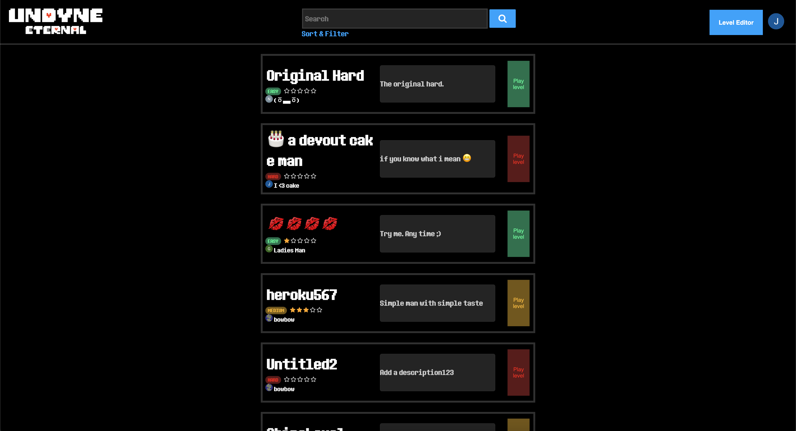
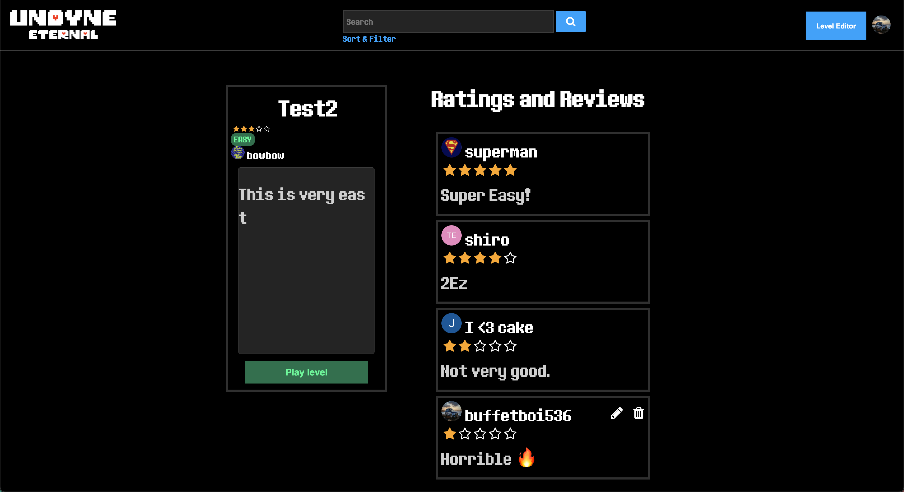
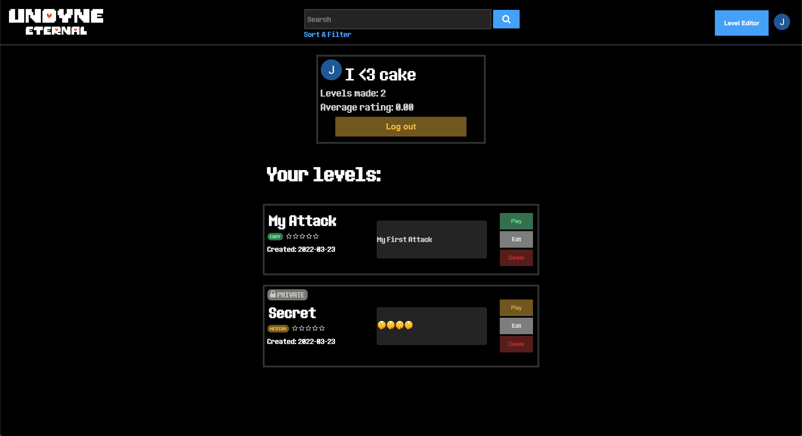
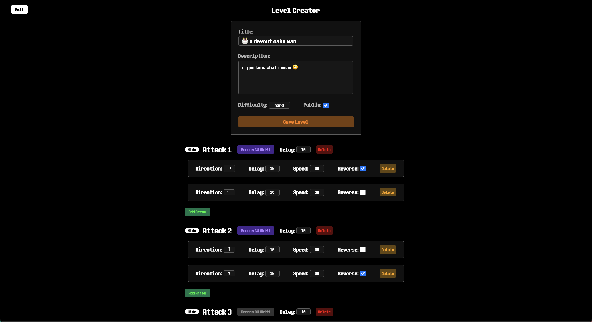
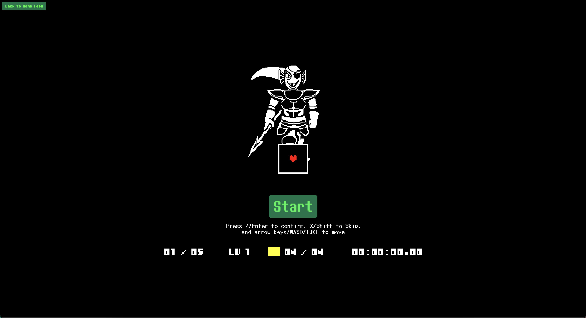

# Undyne Eternal
The game is based off Fairdyne by Joe Zeng but we rewrote a large majority of it from scratch.

## About the game
Undyne eternal is a social platform created around the Fairdyne game with a twist. On this site people can create custom levels and showcase them to public if they wish to, challenge other players on the site, and rate and review levels created by other players. They can even search and filter for levels!

## Key Features
* Added searching, filtering, and sorting levels based on title, description, difficulty, rating, and time.
* Redesigned the game from scratch to improve its structure, reduce bad practices, and incorporate it when our ideals.
* Developed a level creator in which users can design their own levels with many custom options and a cool user interface.
* Made it possible for user to pick their own unique username after logging in and integrating it with Auth0, accounting for users who try to use the same email with different login options.

## Screenshots of Site

The home feed in which you can see all of the posted levels and search, sort, and filter.

The page you see when you click on a level. Here you can, play the level, write a review with a rating, or play the level.

The page you see when on your own profile, which is also similar to the view of others' profiles. Here, you can view, play, edit, or delete your levels and view a couple user metrics.

This is the level creator where you can build levels to play and share with others.

This is the game page where you can play anyone's levels.

## External Dependencies

**Document integrations with 3rd Party code or services here. Please do not document required libraries. or libraries that are mentioned in the product requirements**

* PIXI.js
* howler.js
* pydantic
* firebase_admin

### Contributors
* Sumanth Kaushik Vishwanath, kaush047@umn.edu
* Nikunj Chawla, chawl025@umn.edu
* Aaron Kandikatla, kandi021@umn.edu
* Siyad Gedi, gedi0007@umn.edu
* Sumukh Nitundila, nitun001@umn.edu
